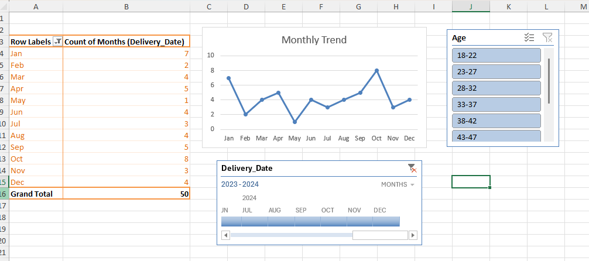

# 🤱 Maternal & Newborn Health Analysis

**Domain:** Healthcare Analytics

**Tools:** Microsoft Excel • Power Query • Power BI • DAX

Transforming maternal and newborn healthcare data into actionable insights through interactive dashboards and data storytelling.

---

# 📸 Dashboard Preview

> 📌 Replace the image below with your dashboard screenshot after uploading it to the **Images** folder.




---

# 📖 Project Overview

The **Maternal & Newborn Health Analysis** project explores delivery trends, maternal complications, newborn outcomes, and high-risk cases using healthcare data. The project transforms raw clinical data into meaningful insights through data cleaning, modeling, interactive dashboards, and storytelling to support evidence-based healthcare decisions.

---

# 🎯 Business Problem

Healthcare providers need timely insights into maternal and newborn outcomes to improve the quality of care and reduce complications.

This project answers important questions such as:

- Which delivery method is most common?
- What are the most frequent maternal complications?
- How many mothers are classified as high risk?
- How do newborn outcomes vary across different delivery methods?
- Are there trends in deliveries over time?
- Which patient groups require closer clinical attention?

---

# ❓ Business Questions

- What is the distribution of delivery types?
- Which maternal complication occurs most frequently?
- What percentage of deliveries are classified as high risk?
- What is the average newborn birth weight?
- What is the average Apgar Score?
- How does maternal age relate to delivery outcomes?
- Are newborn outcomes different between Vaginal and C-section deliveries?
- How do monthly delivery trends change over time?

---

# 🧹 Data Cleaning

The dataset was cleaned and transformed using Microsoft Excel and Power Query.

Data preparation included:

- Checking for missing values
- Formatting Delivery Date
- Removing duplicates
- Creating High Risk Flag
- Creating Month and Year columns
- Standardizing complication categories
- Preparing data for dashboard reporting

---

# 📊 Dashboard Features

The dashboard includes:

### 📌 KPI Cards

- Total Deliveries
- High-Risk Cases
- Average Newborn Weight
- Average Apgar Score

### 📈 Visualizations

- Delivery Type Distribution
- Maternal Complications
- High-Risk vs Low-Risk Cases
- Monthly Delivery Trend
- Average Birth Weight by Delivery Type
- Average Apgar Score by Delivery Type
- Maternal Age Distribution
- High-Risk Cases by Complication

### 🎛 Interactive Filters

- Delivery Type
- Complication
- High-Risk Status
- Year

---

# 💡 Key Insights

- C-section and Vaginal deliveries account for the majority of births, providing insight into delivery patterns.
- Pre-eclampsia, prolonged labor, postpartum hemorrhage, and fetal distress are the most frequently reported complications.
- High-risk cases represent a significant proportion of deliveries, highlighting the need for targeted monitoring.
- Lower Apgar Scores are more common among high-risk deliveries.
- Newborn birth weights vary across delivery methods and complication types.
- Monthly trends help identify periods with increased delivery volume.

---

# ✅ Recommendations

Based on the analysis:

- Strengthen monitoring for pregnancies with identified complications.
- Prioritize early intervention for mothers classified as high risk.
- Improve maternal health education to reduce preventable complications.
- Monitor newborns with low Apgar Scores closely after delivery.
- Use dashboard insights to support resource planning and staffing decisions.

---

# 🛠 Skills Demonstrated

- Healthcare Data Analytics
- Microsoft Excel
- Power Query
- Power BI
- DAX
- Data Cleaning
- Data Modeling
- Data Visualization
- Dashboard Design
- KPI Reporting
- Data Storytelling
- Healthcare Business Intelligence

---

# 📂 Repository Structure

```
Maternal-Newborn-Health-Analysis
│
├── Data
│   └── Maternal_Newborn_Dataset.xlsx
│
├── Images
│   └── dashboard-overview.png
│
├── Dashboard
│   └── Maternal-Newborn-Health.pbix
│
├── Reports
│   └── Project Report.pdf
│
└── README.md
```

---

# 🚀 Outcome

This project demonstrates how healthcare data can be transformed into interactive dashboards that support clinical decision-making, identify high-risk patients, and improve maternal and newborn healthcare outcomes.

---

## 👩‍💻 Author

**Anita Okechukwu**

Healthcare Professional • Data Analyst • Business Intelligence • Aspiring AI Specialist

📧 anitaokechukwu927@gmail.com

---
